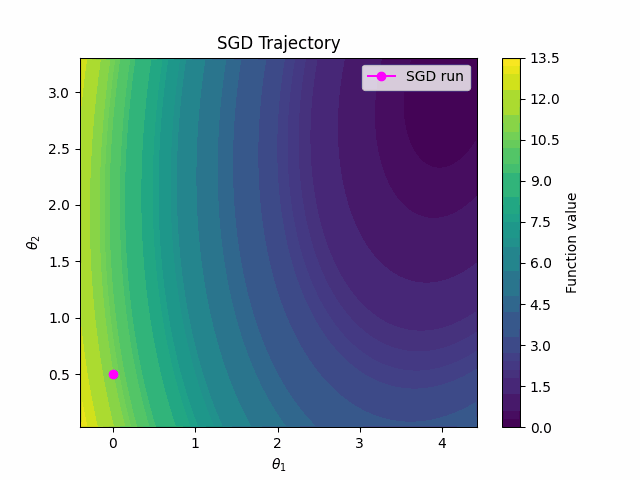

# llmoptim
2024 Fall CMPT-981: LLMs for Optimization

## Installation
```
conda create -n llmoptim python=3.11
conda activate llmoptim
conda install pytorch==2.1.2 torchvision==0.16.2 torchaudio==2.1.2 pytorch-cuda=12.1 -c pytorch -c nvidia

pip install -r requirements.txt
pip install flash-attn==2.5.5 --no-build-isolation
```

## Dependencies for toy2d data, and visualization
```
pip install imageio
pip install imageio[ffmpeg]
```

Run `python llmoptim/data_toy2d.py` to generate the SGD trajectory (ckpt stored in `dataprep_output/*/ckpts` and visuals are stored in `dataprep_output/*/visuals`)

Convex underparameterized example:


## Example Usage

```shell
python toy_mnist_mlp.py

python kernel_inference_parallel.py --ckpts_path toy_mnist_mlp_ckpt_lr_0.01/train/ --llama_v 2 --output_dir toy_mnist_mlp_ckpt_lr_0.01/ --n_threads 4

python sgd_inference_mlp.py --init_ckpt_path toy_mnist_mlp_ckpt_lr_0.01/train/ckpt_000.pth --output_dir toy_mnist_mlp_ckpt_lr_0.01/sgd --kernels_dir toy_mnist_mlp_ckpt_lr_0.01/kernel --steps 100

python visualize_trajectory.py --traj toy_mnist_mlp_ckpt_lr_0.01/sgd/sgd_infer_trajectory.npz --output toy_mnist_mlp_ckpt_lr_0.01/sgd --params fc1.weight/0/0 fc1.weight/1/0
```