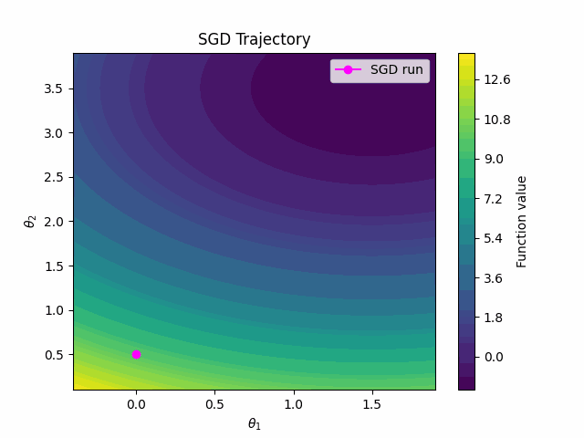

# llmoptim
2024 Fall CMPT-981: LLMs for Optimization

## Installation
```
conda create -n llmoptim python=3.11
conda activate llmoptim
conda install pytorch==2.1.2 torchvision==0.16.2 torchaudio==2.1.2 pytorch-cuda=12.1 -c pytorch -c nvidia

pip install -r requirements.txt
pip install flash-attn==2.5.5 --no-build-isolation
```

## Dependencies for toy2d data, and visualization
```
pip install imageio
pip install imageio[ffmpeg]
```


Run `python llmoptim/data_toy2d.py` to generate the SGD trajectory (stored in checkpoints_2dtoy), also the animation below will be generated at `assets/`



